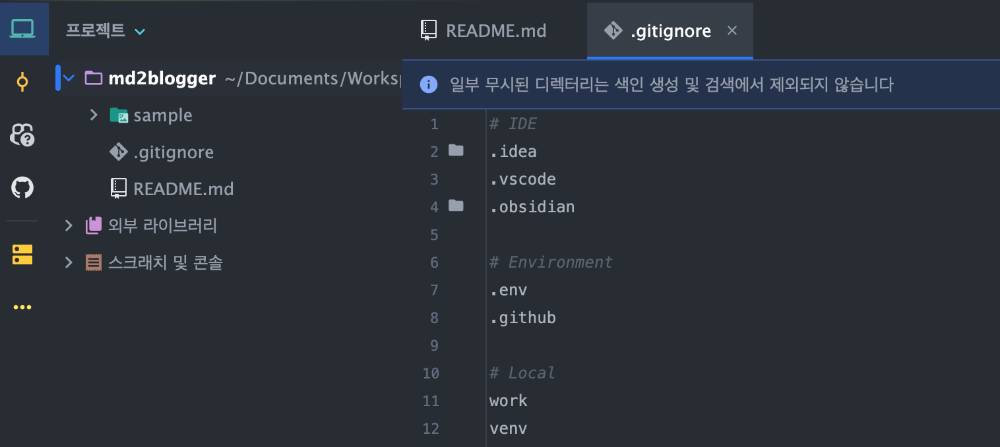

안녕하세요, 이것은 샘플 포스팅입니다.
# 제목1
## 제목2
### 제목3
#### 제목4
##### 제목5
###### 제목6

여기까지는 제목에 대한 테스트였구요, 아래는 각 형식들? 에 대한 테스트입니다.
- 목록1
- 목록2
- 목록3
	- 목록 3.1
- 목록 4

아래는 인용문입니다.
> 안녕하세요, 이것은 인용구입니다.
> 엔터가 잘 적용되나요?

아래는 코드블럭입니다.
```python
print("hello, world!")
```


아래는 테이블입니다

| col1 | col2   | col3      |
| ---- | ------ | --------- |
| 1    | Seoul  | Korea     |
| 2    | Sydney | Australia |

잉 뭐지

아래는 이미지 삽입입니다.



